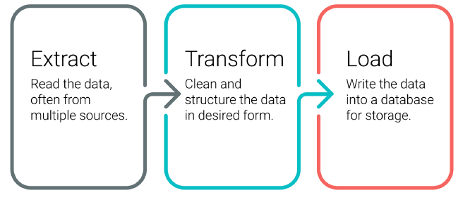
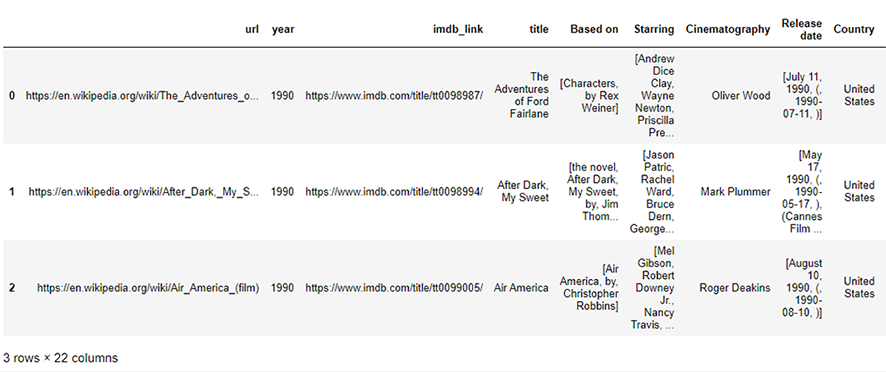
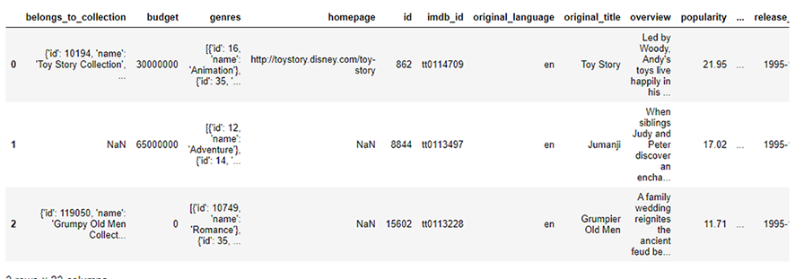
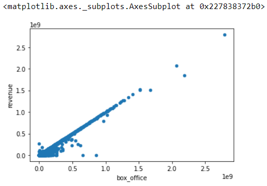
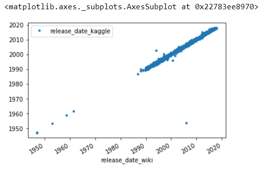

# Movies-ETL
Extract, Transform, and Load the movie files

### Background
Analysis is impossible without access to good data, so creating data pipelines is the first step before any analysis can be performed. Herein, we extract, transform and load (ETL) from Wikipedia(JSON format), Kaggle(csv file) MovieLens_Ratings (csv file) into PostgreSQL,to create data pipelines using python and pandas.

### Goals:

- Create an automated ETL pipeline.
 
- Extract data from multiple sources using Python.

- Clean and transform the data automatically using Pandas and regular expressions.

- Parse data and to transform text into numbers using regular expressions.

- Load new data into existing tables in PostgreSQL

### Resources:

- an web-scraped JSON file of over 5,000 movies from 1990 to 2019, from wikipedia [wikipedia.movies.json](Resources/wikipedia_movies.json)

- a csv file from Kaggle [movies_metadata.csv](Resources/movies_metadata_small.csv)

- a csv file from MovieLens with movie rating information [movies_metadata.csv](Resources/ratings_small.csv)

### Major Outputs:
 - Clean movie dataframe
 

 - Clean Kaggle metadata
 

- Data comparison between wiki and Kaggle data by scatter plots
  - running_time
  

  - budget
  

  - box_office
  

  - Release Date
  

- Merge, drop, and rename the movie file

### The details can be found at the following files

- ETL jupyter notebooks [movies_ETL.ipynb](movie_ETL_process.ipynb)
- ETL Pyscipt [movie_ETL_process.py](Pyscirpt/movie_ETL_process.py)

# Challenge

### Background

 - We will create an automated pipeline that takes in new data, performs the appropriate transformations, and loads the data into existing tables, and refactor the code from this module to create one function that takes in the three files—Wikipedia data, Kaggle metadata, and the MovieLens rating data—and performs the ETL process by adding the data to a PostgreSQL database.

### Goals

* Write a function that reads in the three data files and creates three separate DataFrames using Python, Pandas, the ETL process, and code refactoring.
* Write a function that extracts and transforms the Wikipedia data so you can merge it with the Kaggle metadata.
* Write a function that extracts and transforms the Kaggle metadata and MovieLens rating data, then convert the transformed data into separate DataFrames.
* Write a function that loads the movies_df DataFrame and MovieLens rating CSV data to a SQL database

### Challenge Outputs:

- Challenge automated Pipeline Python script[challenge.py](/challenge.py)

- Challenge automated Pipeline Jupyter NoteBooks [challenge.ipynb](/challenge.ipynb)
