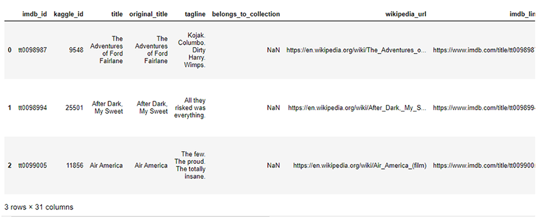

# Movies-ETL
Extract, Transform, and Load the movie files

### Background
- ETL stands for Extract, Transform, Load; it is a process for collecting, cleaning, and saving data. The Extract step reads data from disparate data sources, while the Transform step converts the data into a useful format, and the Load step writes that data into the target database or data warehouse. 
- Regular expressions are a sequence of specific characters that help match or find other strings, or sets of strings, using specialized syntax. Often shortened to "RegEx," they can be used with the Python package "re."
- A lambda function is a short, anonymous function; it can take any number of arguments but only has one expression.

- Herein, we extract, transform and load (ETL) from Wikipedia(JSON format), Kaggle(csv file) MovieLens_Ratings (csv file) into PostgreSQL,to create data pipelines using python and pandas.

### Goals:

- Create an automated ETL pipeline.
 
- Extract data from multiple sources using Python.

- Clean and transform the data automatically using Pandas and regular expressions.

- Parse data and to transform text into numbers using regular expressions.

- Load new data into existing tables in PostgreSQL

### Resources:

- an web-scraped JSON file of over 5,000 movies from 1990 to 2019, from wikipedia [wikipedia.movies.json](Resources/wikipedia_movies.json)

- a csv file from Kaggle [movies_metadata.csv](Resources/movies_metadata_small.csv)

- a csv file from MovieLens with movie rating information [movies_metadata.csv](Resources/ratings_small.csv)

### Major Outputs:

- Clean and data comparison between wiki and Kaggle data by scatter plots
  - running_time
  

  - budget
  

  
- Merge, drop, and rename the movie file

### The details can be found at the following files

- ETL jupyter notebooks [movies_ETL.ipynb](movie_ETL_process.ipynb)
- ETL Pyscipt [movie_ETL_process.py](Pyscirpt/movie_ETL_process.py)

# Challenge

### Background

 - We will create an automated pipeline that takes in new data, performs the appropriate transformations, and loads the data into existing tables, and refactor the code from this module to create one function that takes in the three files—Wikipedia data, Kaggle metadata, and the MovieLens rating data—and performs the ETL process by adding the data to a PostgreSQL database.

### Goals

* Write a function that reads in the three data files and creates three separate DataFrames using Python, Pandas, the ETL process, and code refactoring.
* Write a function that extracts and transforms the Wikipedia data so you can merge it with the Kaggle metadata.
* Write a function that extracts and transforms the Kaggle metadata and MovieLens rating data, then convert the transformed data into separate DataFrames.
* Write a function that uploads the movies_df DataFrame and MovieLens rating CSV data to a SQL database

### Challenge Outputs:

1. The functions convert the Wikipedia JSON file, Kaggle metadata file, and MovieLens ratings data file to a Pandas DataFrame and, the DataFrame is displayed in 
  -Jupyter NoteBooks [ETL_function_test.ipynb](ETL_function_test.ipynb) and Python script [challenge.py](Pyscirpt/ETL_function_test.py)

2. The Wikipedia raw data is cleaned and converted to a Pandas DataFrame, and the DataFrame is displayed in  -Jupyter NoteBooks [ETL_clean_wiki_movies.ipynb](ETL_clean_wiki_movies.ipynb) and Python script [ETL_clean_wiki_movies.py](Pyscirpt/ETL_clean_wiki_movies.py)

3. The Kaggle metadata is cleaned and merged with Wikipedia and Kaggle DataFrames, and the movies_with_ratings_df and the movies_df DataFrames are displayed in -   -Jupyter NoteBooks [ETL_clean_kaggle_data.ipynb](ETL_clean_kaggle_data.ipynb) and Python script [ETL_clean_kaggle_data.py](Pyscirpt/ETL_clean_kaggle_data.py)

4. Uploade the movies_df DataFrame and MovieLens rating CSV data to a SQL database and prints out the elapsed time to import each row.The fuction code and elapsed-time to add the data to the database is displayed in Jupyter NoteBooks [ETL_create_database.ipynb](ETL_create_database.ipynb) and Python script [ETL_create_database.py](Pyscirpt/ETL_clean_kaggle_data.py)

- The movies table in the SQL database

- The ratings table in the SQL database

- Elapsed time to add the data to the database

### Conclusions
- Creating a function is more effective way to extract, transform and load process to a PostgreSQL database for large datafile.
- From ETL process we can collect, clean, and uploade the data into the sql server. Importing a rating data takes quite a long time (3572.5107519626617 seconds) and  it's helpful to see the time information.

